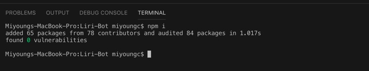
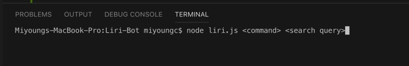
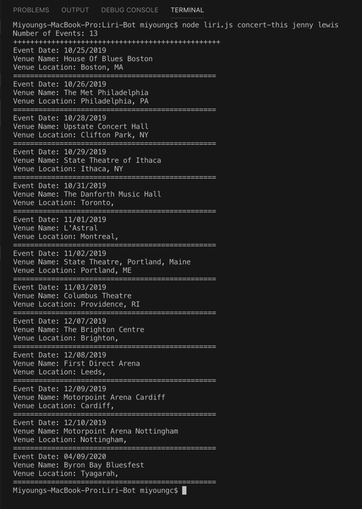
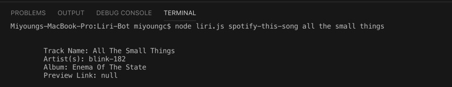
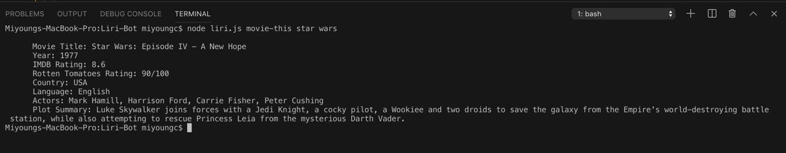
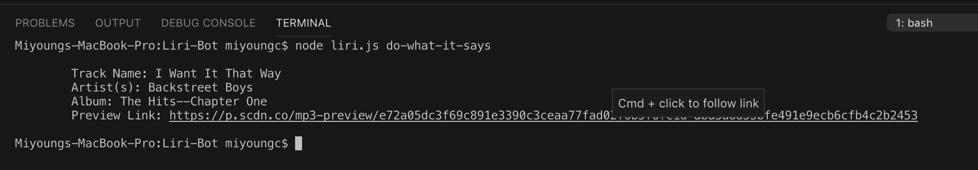

# Liri-Bot

###Liri-Bot is a Language Interpretation and Recognition Interface, similar to SIRI however recognizing language instead of speech. 

LIRI is like iPhone's SIRI. However, while SIRI is a Speech Interpretation and Recognition Interface, LIRI is a _Language_ Interpretation and Recognition Interface. LIRI will be a command line node app that takes in parameters and gives you back data.

The parameters Liri-Bot takes are: 

* 'concert-this'
* 'spotify-this-song'
* 'movie-this'
* 'do-what-it-says'

## Getting Started 

To start using Liri, navigate to the root of your folder from terminal and enter the command 'npm i' to download dependencies. 
You can access screen shots from images folder to better view the functions of each Liri command.

The command line structure for Liri is as follows: 

Below is list of displayed images to show how each Liri function works. 

## Liri Commands

##### 'concert-this'
The 'concert-this' function takes in the name of an artist and searches The Bands in Town API for events and sends back the following information back into the terminal. 

* Date of the Event
* Venue Name 
* Venue Location

##### 'spotify-this-song'
The 'spotify-this-song' function takes in the name of a song and searches for the song on Spotify to return the following information to the terminal. 

* Name of the Track 
* Name of the Artist
* Name of the Album 
* Preview Link to the Track on Spotify

##### 'movie-this'
The 'movie-this' function takes in the name of a movie and searches the OMDB API to return the following information to the terminal. 

* Title of the Movie 
* Year of Release 
* IMDB Rating 
* Rotten Tomatoes Rating 
* Country where the movie was produced 
* Actors of the Movie
* Plot Summary 

##### 'do-what-it-says'
The 'do-what-it-says' function takes a command from a text file to produce its own search query for the OMDB API to return information to the terminal. 

